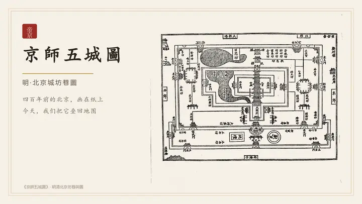

# 帝京寻踪 · 明代北京古今地图

以明·刘侗、于奕正《帝京景物略》（1635）为骨架，把四百年前的北京地名**叠加回今天的百度地图**：
点击「太學石鼓」直达「孔庙和国子监博物馆」，一眼看到原书记载、关联诗词、白话今译，以及清人在《京城古迹考》里对同一地点的实地核访。

参赛方向：百度地图开放平台「开发者创作大赛」· 创意应用

---

## 作品演示（60 秒）

[](https://kint23.github.io/ohBJ/video/demo.mp4)

**点上面的动图即可播放正片**（MP4，约 53 MB，浏览器内直接播放，无需下载）：
<https://kint23.github.io/ohBJ/video/demo.mp4>
🖥 **在线 Demo**：<https://kint23.github.io/ohBJ/> ｜ 📷 **封面图**：`banner/帝京寻踪-banner-1200x675.png`

> 正片内容：5 秒《京師五城圖》古地图开场 → 实机操作（三重筛选 → 点开盧溝橋 →
> 白话今译 / 原书记载 / 关联诗篇 / 清人实地核访 → 智能排线 3 方案 → 百度路线规划真实里程）→ 落版。
> 上方动图为正片节选（无声），完整版含字幕与原创配乐。

> 📌 说明：GitHub 的 README 会过滤 `<video>` 标签，因此这里用**可点击的动图预览**代替内嵌播放器；
> 想要真·内嵌播放器，只能把 MP4 作为 GitHub 附件上传（见 `docs/提交材料.md`）。

---

## 一、快速开始

### 1. 本地预览（必须用本地服务器，不能双击 html）

```powershell
uv run python -m http.server 8080
# 然后打开 http://localhost:8080/
```

> 直接双击 `index.html` 会因浏览器 CORS 限制无法读取 `data/places.json`。

### 2. 配置百度地图 AK

1. 到 <https://lbsyun.baidu.com/apiconsole/key> 创建 **浏览器端** AK；
2. 应用设置里把 **Referer 白名单** 填上 `localhost` 和你的正式域名；
3. 把 AK 填进 `app/config.js` 的 `ak` 字段，刷新页面。

> `ak` 留空时页面**仍然可用**——列表、原文、诗词、今译、行程都能浏览，只是没有底图，并会给出提示。
> **服务端 AK 是敏感凭据，永远不要写进 `app/config.js`，也不要提交到仓库。**

### 3. 部署

纯静态站点，无构建步骤。推到 GitHub 后开启 Pages 即可（仓库根目录为站点根目录），
记得把仓库域名加进 AK 的 Referer 白名单。

---

## 二、数据流水线（可复现）

```
古籍 txt  ──①抽取──▶  entries.json / guben.json
                          │
          mapping.json ───┤───②构建（繁简归一 + WGS84→BD-09）──▶  places.json ──▶ 前端
       vernacular.json ───┘
                                    ③核验（WebAPI）──▶ coords_verified.json
                                    ④自检 validate.py
```

| 步骤 | 命令 | 说明 |
|---|---|---|
| ① 抽取 | `uv run tools/extract_places.py` | 解析《帝京景物略》**127 目 / 1346 首诗**、《京城古迹考》46 条沿革 |
| ② 构建 | `uv run tools/build_places.py` | 合并策展映射与今译，**WGS-84 → BD-09** 坐标转换 |
| ③ 核验（浏览器）| 页面侧栏「数据质量 · 坐标核验」→ 下载 `coords_verified.json` → 存回 `data/` → 重跑② | 用**浏览器端 AK**，无需服务端应用。**本版 30 条即由此核验** |
| ③′ 核验（服务端）| `$env:BAIDU_MAP_AK="..."`<br>`uv run tools/verify_coords.py --apply` | 备用：用 WebAPI 批量核验（需服务端 AK 的 IP 白名单） |
| ④ 同步行程 | `uv run tools/sync_routes.py` | 用真实坐标重算 `routes.json` 的 `est_km / travel_minutes / hours / stops_total` |
| ⑤ 自检 | `uv run tools/validate.py` | 字段完整性、坐标范围、行程引用完整性、里程自洽 |

### 数据规模

| 项 | 数量 |
|---|---|
| 《帝京景物略》总目 | **127 目**（8 卷） |
| 关联诗篇 | **1346 首**（本站收录 519 首，页面展示 165 首全文） |
| 本版策展地点 | **30 处**（均有明确古今传承） |
| 坐标核验 | **30/30**（浏览器端 AK + 地点检索逐条比对，偏差中位数 < 0.5 km） |
| 清人沿革文本 | 12 条（自动从《京城古迹考》匹配"臣按…今查…"） |
| 行程 | **8 个半日步行圈 + 2/3/5 日三档** |

---

## 三、目录结构

```
index.html                  单页 Demo 入口
app/
  config.js                 AK 配置 + JSAPI 加载握手
  app.js                    地图、筛选、详情、多方式行程规划
  planner.js                智能排线：3 个候选方案（时长/兴趣/出行方式）
  verify.js                 数据质量：用浏览器端 AK 核验坐标并导出
  guide.js                  明代北京城 AI 导游（本地意图解析 + 地图工具调用）
  style.css                 纸墨风格样式
data/
  places.json               ★ 前端唯一数据源（30 地，BD-09）
  routes.json               行程分档（步行圈 + 2/3/5 日；距离/耗时由 sync_routes 生成）
  coords_verified.json      坐标核验结果（由 verify.js 导出后回填）
  entries.json              抽取结果：127 目全文 + 诗词
  guben.json                《京城古迹考》46 条沿革
  curated/
    mapping.json            人工策展：明清名 → 今名/今址/种子坐标
    vernacular.json         人工校对的白话今译
tools/
  extract_places.py         ① 古籍结构化抽取
  build_places.py           ② 合并 + 坐标转换
  verify_coords.py          ③′ 用服务端 AK 批量核验（备用）
  sync_routes.py            ④ 用真实坐标重算行程距离/耗时
  validate.py               ⑤ 数据自检
docs/
  可行性分析与方案.md        赛前可行性、约束与风险分析
  提交材料.md                作品简介、视频脚本、拉票文案、提交清单
  部署指南.md                GitHub Pages / 其他托管 + AK 白名单设置
.github/workflows/pages.yml 推送到 main 即自动部署演示站（自动排除古籍原文等大文件）
```

---

## 四、技术要点
1. **古籍结构化抽取**：以"短行 + 无缩进 + 无标点 + 无 `·`"识别目录标题，`【…】` 识别诗词题名，
   自动分离**正文 / 诗文 / 作者朝代**；实测在《帝京景物略》上稳定得到 127 目、1346 首诗。
2. **地名实体消解**：`best_match` 做"繁简归一 + 包含关系 + 长度约束"的模糊匹配，
   连通「太學石鼓 → 石鼓」这类异名与省称。
3. **坐标系正确性**：古人当然没有坐标，本项目的坐标全部经 **WGS-84 → GCJ-02 → BD-09** 换算，
   并通过百度 WebAPI 回核；未核验的一律标注 `seed-approx`，页面上可见。
4. **置信度可追溯**：每个地点带 `confidence` 与 `coord_precision`，
   已湮灭或占地较广的地名以**范围圆**表示，不假装成精确点。
5. **自证自洽**：`tools/validate.py` 可复现所有里程数字——路线标注的 `est_km`
   与相邻站点直线距离之和一致（误差 < 1%）。
6. **多出行方式路线规划**：步行 / 骑行 / 驾车 / 公交 / **混合（按腿直线距离自动选）**。
   - 混合规则：< 1.5 km 步行，1.5–4 km 骑行，> 4 km 公交。
   - 踩坑记录：BMapGL 的 `getPlan(0).getDistance()` / `getDuration()` **返回的是带单位的字符串**
     （实测为 `"2.4公里"` / `"35分钟"`），不是数字。直接 `Number()` 会得到 `NaN`，
     必须解析单位（并兼容 `"1小时20分钟"` 这类组合形式）。
   - 百度未返回数值时，回退为「直线距离 + 经验速度」估算，并在界面上用 `≈` 明示。
7. **智能排线 · 3 个方案**（`app/planner.js`）：只给时长 / 兴趣 / 出行方式，
   用三种不同策略各造一条线，去重后给 3 个取舍不同的方案（最近邻少走 / 标签优先 / 内容优先）。
   - 工程上的三个坑：① 候选池小时固定半径会走成死胡同 → 逐级放宽半径；
     ② 两个策略可能退化成同一条线（3 个方案变 2 个）→ 按签名去重并回退到次优种子；
     ③ 为凑满 3 个而拿 1 站方案充数没意义 → 加最少 2 站的阀值，宁可只给 2 个。

### 用到的百度地图能力一览

| 能力 | 调用处 | 用途 |
|---|---|---|
| JSAPI GL 地图底座 | `BMapGL.Map` / `Point` / `ScaleControl` | 底图、中心与缩放、比例尺 |
| 覆盖物 | `BMapGL.Marker` / `Label` / `Circle` / `Polyline` / `InfoWindow` | 30 处标记与标注、已湮灭地名的范围圈、行程连线与编号、详情气泡 |
| 周边检索 | `BMapGL.LocalSearch.searchNearby(kw, pt, 1000)` | 一键找附近餐饮 / 厕所（1 km 内） |
| 地理编码（端内） | `BMapGL.Geocoder` | 核验面板：地址 → 坐标，偏差 < 3 km 自动写回并标记「已核验」 |
| 路线规划 | `BMapGL.WalkingRoute` / `RidingRoute` / `DrivingRoute` / `TransitRoute` | 步行 / 骑行 / 驾车 / 公交 / 混合，取真实里程与耗时 |
| WebAPI 地点检索 | `place/v2/search` | 离线流水线回核 30 处坐标（30/30 命中） |
| WebAPI 地理编码 | `geocoding/v3/` | 离线把今名地址解析成经纬度 |

> 坐标换算链 **WGS-84 → GCJ-02 → BD-09** 由本地脚本完成，不消耗线上配额。

---

## 五、合规章节

- 古籍原文属**公有领域**（明·刘侗/于奕正 1635；清·励宗万；清·于敏中）。
  本项目**未使用**任何现代出版社的点校本标点、校勘或译注。
- 今译由 AI 生成并人工校对，页面统一标注「AI 辅助译文，仅供参考」。
- 底图使用**百度地图**官方服务，不自行绘制或替换底图（不涉及测绘资质与审图号问题）。
- 坐标与内容仅供参考，不作为定位依据。

---

## 六、待办

- [x] 配置浏览器端 AK，地图与 AI 导游已实测可用
- [x] 多出行方式路线规划（步行/骑行/驾车/公交/混合）已实测
- [x] **30 条坐标已用百度地点检索核验**并写回（`coord_source=verified-by-ak`，页面可见）
- [x] 行程距离/耗时改为从数据自动生成（`tools/sync_routes.py`），不再手改
- [x] 智能排线（3 个方案）+ AI 导游接入
- [x] **已部署上线**：<https://kint23.github.io/ohBJ/>（该域名已加入 AK 的 Referer 白名单）
- [x] Banner 与 60 秒正片已生成（见 `docs/AI素材说明.md`）
- [ ] 上传正片到 B 站，并把链接填进报名表
- [ ] 补录卷一~卷七其余 72 目，以及卷八「畿辅名迹」
