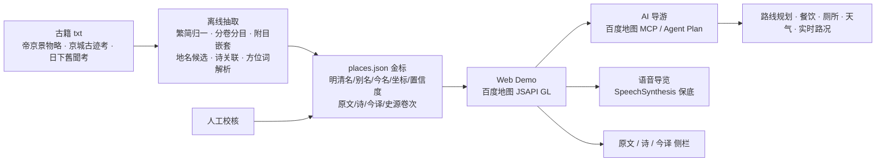

# 「帝京景物略 · 古今地图」参赛可行性分析与方案

> 目标赛事：百度地图开放平台「开发者创作大赛」（https://lbs.baidu.com/developer/hackathon）
> 分析日期：2026-09-28 ｜ 状态：**仅分析，未写代码**
> 本文件是决策依据与开工蓝图；代码与数据产出另立目录。

---

## 0. 结论速览

| 判定 | 内容 |
|---|---|
| ✅ 可行且应做 | ① 从本地 txt 抽取明清地名 + 关联片段／诗；② 古今地名点击跳转 + 原文/今译展示；③ 在百度地图中导航到最近景点；④ 路线规划（时间/交通/餐饮/厕所） |
| ⚠️ 换路径做 | ⑤ **Mapya 不是地名考证 API**，运行时不能依赖它 → 改用 地理编码 + 地点检索 + MCP + 人工校核；⑥ 语音导览 → Web 端无官方播报，改浏览器 `SpeechSynthesis` 保底 |
| ❌ 必须砍掉 | ⑦ **在「萝卜快跑」内进入明朝导览**（Apollo 开放平台是自动驾驶研发平台，萝卜快跑无第三方内容注入 SDK）→ 仅作为路演"未来愿景"一句话 |
| 🔴 最大约束 | **作品征集 08.27–09.30**，按当前日期仅剩约 **2 天** → 只能做「冲刺版」：**30 个景点 + 单页 Demo + 3 分钟视频** |

**已按安全默认值拍定的取舍**（用户暂无法确认，如需变更请覆盖）：
1. 按 09-30 截止 → 走 **A 档冲刺版**；
2. 砍掉萝卜快跑内导览；
3. 第一版只做 **30 个可考景点**，不做全量 127 目；
4. 今译由 LLM 生成 + 人工校对，标注"AI 辅助译文"；
5. 语音先用浏览器 TTS，不额外开通云 TTS；
6. 参赛分类建议「**创意应用**」；项目名建议「**帝京寻踪**」或「**燕都拾遗**」。

---

## 1. 赛事硬约束（已核实）

### 1.1 日程

| 阶段 | 时间 | 备注 |
|---|---|---|
| 作品征集 | 08.27 – **09.30** | 距今约 **2 天** |
| 公众投票 | 08.27 – 09.30 | 票数影响最终排名，需同步拉票 |
| 评委评审 | 10.08 – 10.12 | 四维度打分 |
| Top5 路演 | 10.15 | 奖金池 ¥30,000；金奖 1 名、优秀奖 3 名、人气奖 5 名 |

> ⚠️ 页面未标年份。按当前日期推算即为本届；**开工前请先到活动页/后台确认倒计时**。若已过期，可行性结论不变，但工期可放宽到 C 档。

### 1.2 参赛规则

- 必须**以百度地图 API/SDK 为核心功能**；
- 作品须**包含可演示的 Demo 或视频**；
- 原创、未在其他竞赛获奖；**每个账号限提交 2 件作品**。

### 1.3 评分维度（决定投入方向）

| 维度 | 权重 | 本项目的得分点 |
|---|---|---|
| 创意性 | 30% | 古籍→地图的"时空折叠"体验；明清地名落点 |
| **技术深度** | **30%** | **古籍 NLP 抽取流水线 + 地名实体消解 + 置信度分级 + MCP AI 导游** |
| 实用性 | 25% | 真实可用的城市文化导览 + 一键规划路线 |
| 展示完整度 | 15% | 单页 Demo 部署上线 + 3 分钟视频 + README |

### 1.4 提交物清单

作品名称 / 作品分类 / 开发者或团队名称 / 联系邮箱 / 作品简介 / **Demo 或视频链接** / Banner 图（1200×675，JPG/PNG，≤5MB）/ GitHub 仓库（选填）。

---

## 2. 语料实测盘点

### 2.1 总览

| 文件 | 体积 | 行数 / 字数 | 结构 | 角色 |
|---|---|---|---|---|
| **帝京景物略** | 0.58 MB | 4,972 / 210,770 | 序 + 略例 + **8 卷 127 目**，1,347 处 `【诗题】` | ★ **主骨架**（一"目"≈一地点，正文 + 诗群） |
| **日下舊聞考** | 1.13 MB | 6,550 / 401,499 | 清·于敏中，按方位/门类编排，含大量"按语" | 扩充与交叉印证 |
| **京城古迹考** | 0.04 MB | 103 / 13,146 | 清·励宗万；东城/南城/西城 + 条目，形如"**臣按…今查…**" | ★ **古今对照金矿**（可直接作沿革文本模板） |
| **燕京岁时记** | 0.07 MB | 358 / 23,290 | 节令风俗 | 辅助：**时间轴**导览层，非地点维度 |
| **畿辅通志** | 5.03 MB | 87,261 / 1,892,593 | 全直隶省通志 | 只取"京师/顺天府"相关卷，其余忽略 |

### 2.2 关键事实

- **均为 UTF-8 无 BOM 纯文本**，无乱码、**无需 OCR** → 省下 1–2 天。
- **正文为繁体**（`城東內外`、`淨業寺`），需繁→简 + 异体字归并（内/內、峯/峰、臺/台…）。
- **语料内没有任何坐标**，只有文字方位（"齐化门外"、"贡院之南"、"宣武门内"）。
- 结构为"**主目 + 附目**"：作者《略例》明言"園林寺院，有名稱著而駢列以地，如淨業寺、蓮花庵之附水關，李園、米園之附海淀者"。
  → 解析时须支持**一层嵌套**，否则会漏掉附目或误判为主目。

### 2.3 目录统计（实测 127 目）

| 卷 | 卷名 | 目数 | 空间性质 |
|---|---|---|---|
| 一 | 城北內外 | 16 | 内城 |
| 二 | 城東內外 | 13 | 内城 + 东郊 |
| 三 | 城南內外 | 20 | 外城 + 南郊（含卢沟桥、南海子） |
| 四 | 西城內 | 14 | 内城 |
| 五 | 西城外 | 17 | 西郊（海淀、万寿寺…） |
| 六 | 西山上 | 12 | 西山 |
| 七 | 西山下 | 10 | 西山 |
| 八 | 畿輔名跡 | 25 | **京外**（盘山、上方山、银山、红螺山…） |
| — | **合计** | **127** | 城内+近郊（卷一~七）= **102 目** |

> 决策：第一版只覆盖**卷一~卷七中可考的 30 目**；卷八 25 目（京外）整体延后，不属"北京城历史地图"的最近范围。

### 2.4 一个必须注意的坑：古今分类体系不一致

同一地点在两书中的归属不同 —— 例：`天寧寺塔` 在《帝京景物略》属**卷三 城南內外**，在《京城古迹考》属**西城**（因清代城墙/方位认知不同）。

→ **不能直接沿用原书卷次作为现代分区**，必须自建一套统一的空间体系（建议：以百度地图坐标系为准 + 内城/外城/近郊三级标签 + 保留原书卷次作为"史源字段"）。

---

## 3. 可行性逐项判定

| # | 目标 | 判定 | 依据 / 替代路径 |
|---|---|---|---|
| a | 从 txt 抽明清地名 + 片段 | ✅ 高 | 纯文本、结构清晰、有卷/目/附目规则 |
| b | 用 **Mapya** 联接今日地名/地址 | ⚠️ 中 | Mapya（lbs.baidu.com/ai/mapya）是**聊天式智能体**，且提问示例偏向"给我 JSAPI 示例代码"，**未验证可程序化调用**；FAQ 有「是否可以使用脉芽 MapYA 参赛？」（页面为 JS 渲染，答案需人工确认）。→ 可靠路径：**地理编码 + 地点检索 + MCP + 人工校核**；Mapya 仅作作者侧辅助 |
| c | 点击古今地名 → 现实地址 + 原文/今译 | ✅ 高 | JSAPI `Marker` + `InfoWindow` |
| d | 在百度地图中使用 / 导航最近景点 | ✅ 高 | URI API 调起百度地图；或 JSAPI 内嵌路线规划 |
| e | 时间/交通/游玩时长/餐饮/厕所 → 路线规划 | ✅ 高（除"游玩时长"） | 路线规划、地点检索齐备；**"预计游玩时长"无官方数据源，须自建知识库**（可对 30 个景点手工标注 30–120 分钟） |
| f | 导览语音 | ⚠️ 中 | Web 端 JSAPI **无官方语音播报**；保底浏览器 `SpeechSynthesis`（中文 TTS，零成本、零开通）；更高音质需百度智能云 TTS（另开通计费）；官方语音播报只在 Android/iOS/Harmony 导航 SDK 中 |
| g | 在**萝卜快跑**内进入明朝导览 | ❌ 不可行 | Apollo 开放平台面向前装/自动驾驶研发；萝卜快跑为自有 App，**无第三方内容注入入口**。→ 降级为路演愿景 |

---

## 4. 核心技术难点：落点

这是全项目成败所在，也是"技术深度"的评分支点。

### 4.1 三类地名

| 类型 | 占比(估) | 例子 | 处理 |
|---|---|---|---|
| 可直接查得 | ~40% | 國子監、天寧寺、白塔寺(妙應寺)、盧溝橋、護國寺、報國寺、白雲觀 | 地理编码/地点检索直接命中 |
| 需别名/形近推理 | ~30% | **太學石鼓**→国子监；**淨業寺**→什刹海后海西岸；**慈壽寺**→阜成门外八里庄塔；**弘仁橋**→今马驹桥；**崇國寺**→护国寺（元代旧名） | 别名表 + 方位词解析（"齐化门外"→朝阳门外） |
| 已消亡 / 拓扑已变 | ~30% | 水關、漫園、米仲詔園、定國公園、梁氏園、李園、魚藻池、土城、翰林院… | 只给"**大致范围圆**"，强制标注置信度 |

### 4.2 地理可靠性分界

- **明清北京内城 ≈ 今二环内**，城门位置可精确锚定 → 城内条目坐标可信。
- **城外**（西山诸刹、丰台、弘仁桥、土城、海淀园林）河道与聚落已巨变，自动化落点误差可达**公里级**。

### 4.3 必须的"三件套"

**LLM 抽取候选 → 地理编码/POI 检索召回 → 人工校核**。纯自动化准确率不可用于公开展示。

产出物 `places.json`（校核后的金标数据）**才是项目真正的资产**。

### 4.4 合规红线（务必遵守）

- 🚫 **不要自己贴一张明代北京城图当底图** —— 底图涉及测绘资质与审图号。
- ✅ 正确做法：**以百度地图为底图**，历史信息以点标记、注记、半透明覆盖层、文字说明形式叠加。
- 页面需保留百度地图相关版权/审图号标识，不遮挡、不裁剪。

### 4.5 版权

- 古籍原文本身为公版（明·刘侗/于奕正 1635；清·于敏中等）。
- **但现代出版社的点校本标点/校勘、以及现代译注本可能有著作权** → 用公版原文自行标点/校核，**不抄现代译注**。
- 今译：LLM 生成 + 人工校对，页面标注"AI 辅助译文，仅供参考"。
- 视频/页面中出现古籍原文须标注来源书目与卷次。

---

## 5. 所需资源清单

### 5.1 账号与密钥

| 资源 | 用途 | 关键限制 |
|---|---|---|
| 百度账号 + **实名认证** | 申请 AK | **必须做个人认证**，否则地点检索仅 100 次/日 |
| **浏览器端 AK** | JSAPI GL 展示 | 需绑 **Referer 白名单**；本地调试用 `localhost`，上线须填真实域名 |
| **服务端 AK** | WebAPI 批量跑校核流水线 | 需绑 IP |
| **MCP Token** | AI 导游（对话式问路/找厕所/找餐饮） | 二选一：`https://mcp.map.baidu.com/mcp?ak=<你的AK>`（需开通 MCP 服务）或 **Map Agent Plan**（零门槛，一个 Token 解锁地点检索/路线规划/实时路况） |
| Docs MCP | 开发期查文档，避免 API 记忆错误 | 免费；`https://docs.map.baidu.com/mcp`；**不执行请求、不提供 AK** |
| JSAPI / WebAPI Skills | 让 AI 助手读官方文档写代码 | 免费；`npx skills add baidu-maps/jsapi-skills` |
| 静态托管 | Demo 上线供评委点开 | 需 **HTTPS** 域名，并填入 JSAPI Referer 白名单 |

### 5.2 配额（2025-10 版开发者权益表）

| 服务 | 未认证 | 个人认证 | 企业认证 |
|---|---|---|---|
| 地理编码 | 5,000/日 (QPS 3) | 100,000/日 (QPS 30) | 3,000,000/日 |
| **地点检索** | **100/日** (QPS 3) | **2,000/日** (QPS 30) | 50,000/日 |
| 路线规划（含轻量） | 5,000/日 | 100,000/日 | 300,000/日 |
| 实时路况 | 2,000/日 (QPS 3) | 5,000/日 | 5,000/日 |
| 地理编码（JS API） | 5,000/日 | 100,000/日 | 3,000,000/日 |
| 地点检索（JS API） | 100/日 | 2,000/日 | 50,000/日 |

> ⚠️ **地点检索是瓶颈**：未认证仅 100 次/日，跑一批 127 目的落点会立刻打光。
> → 个人认证（2,000/日）是**必需动作**；离线校核结果**必须本地缓存**（`places.json` 即缓存），分批跑、避免重复调用。

### 5.3 人力

| 角色 | 工作量 | 说明 |
|---|---|---|
| 坐标校核 | **最耗时**，30 条约 4–6 h | 无法自动化，须逐条看地图 |
| 今译校对 | 30 条约 3–4 h | LLM 初译 + 人工润色 |
| 前端页面 | 约 5 h | 单页地图 + 侧栏 + 弹窗 |
| 视频剪辑 | 约 3 h | 3 分钟，屏幕录制 + 配音 |

---

## 6. 建议架构（无代码，仅蓝图）

---

## 7. 数据契约草案（`places.json` 字段）

> 这是"抽取"与"展示"之间的接口，先定契约再动手，避免返工。

| 字段 | 类型 | 说明 |
|---|---|---|
| `id` | string | 稳定 ID，如 `djjwl-v1-003` |
| `ming_name` | string | 明清原书地名（繁体原文，保留） |
| `ming_name_simp` | string | 简体归一后名称 |
| `aliases` | string[] | 别名 / 异名（如 崇國寺→護國寺、憫忠寺→法源寺） |
| `volume` | string | 原书卷次（卷一…卷八），作为**史源字段**，不作现代分区 |
| `is_attached` | bool | 是否为附目（附于主目之下） |
| `parent_id` | string? | 附目的主目 ID |
| `modern_name` | string | 今日地名/POI 名 |
| `modern_addr` | string | 今日地址 |
| `lng` / `lat` | number | BD-09 坐标 |
| `coord_precision` | enum | `point` \| `area` \| `approx`（已消亡地名用 `area`/`approx`） |
| `confidence` | enum | `high` \| `medium` \| `low`（**必须在前端可见**） |
| `src_text` | string | 原文片段（节选，标注卷/目） |
| `poems` | object[] | `{author, dynasty, title, text}` |
| `vernacular` | string | 现代译文（标注"AI 辅助译文"） |
| `history_note` | string | 沿革说明（优先取《京城古迹考》"臣按…今查…"） |
| `visit_minutes` | number | 建议游玩时长（自建知识库） |
| `tags` | string[] | 寺庙/园林/城门/河湖/坛庙… |

---

## 8. 第一版短名单（30 条，全部取自实测目录）

| # | 明清名（原书） | 今名 / 今址 | 卷 | 落点难度 | 备注 |
|---|---|---|---|---|---|
| 1 | 太學石鼓 | 北京孔庙和国子监博物馆 | 一 | 易 | 石鼓实物今存 |
| 2 | 文丞相祠 | 文天祥祠（府学胡同） | 一 | 易 | 多首诗 |
| 3 | 水關 | 什刹海（后海西岸、银锭桥一带） | 一 | 中 | **含附目：淨業寺、蓮花庵、漫園、米仲詔園** |
| 4 | 十刹海 | 什刹海 | 一 | 易 | — |
| 5 | 大隆福寺 | 隆福寺（东四） | 一 | 易 | — |
| 6 | 火神廟 | 火神庙（地安门外） | 一 | 易 | — |
| 7 | 于少保祠 | 于谦祠（东单裱褙胡同） | 二 | 中 | 今为民居，《京城古迹考》已叹"求所謂忠肅祠者，皆曰不知" |
| 8 | 泡子河 | 崇文门东、贡院南（近观象台） | 二 | 中 | 已湮，给范围圆 |
| 9 | 燈市 | 灯市口大街 | 二 | 中 | 街名沿用 |
| 10 | 東嶽廟 | 北京东岳庙（朝阳门外） | 二 | 易 | 元代碑刻 |
| 11 | 三忠祠 | 山右三忠祠（土地庙上斜街） | 二 | 中 | 《古迹考》有专条 |
| 12 | 黃金臺 | 金台夕照（朝阳区） | 二 | 低 | 地点有争议 → 用 `approx` |
| 13 | 金魚池 | 金鱼池（天坛北） | 三 | 中 | 即《古迹考》"藻池"，今为小区 |
| 14 | 憫忠寺 | 法源寺 | 三 | 易 | — |
| 15 | 報國寺 | 报国寺（广安门内） | 三 | 易 | 今为古玩市场 |
| 16 | 天寧寺 | 天宁寺塔（广安门外） | 三 | 易 | 辽塔尚存 |
| 17 | 白雲觀 | 白云观（西便门外） | 三 | 易 | — |
| 18 | 盧溝橋 | 卢沟桥 | 三 | 易 | — |
| 19 | 弘仁橋 | 马驹桥（碧霞元君庙/大南顶） | 三 | 中 | 元称马驹桥 |
| 20 | 南海子 | 南海子公园（大兴） | 三 | 中 | — |
| 21 | 白塔寺 | 妙应寺白塔（阜成门内） | 四 | 易 | — |
| 22 | 帝王廟 | 历代帝王庙（阜成门内） | 四 | 易 | — |
| 23 | 朝天宮 | 朝天宫遗址（宫门口一带） | 四 | 低 | 已毁 → `area` |
| 24 | 天主堂 | 宣武门天主堂（南堂） | 四 | 易 | 利玛窦相关 |
| 25 | 萬松老人塔 | 万松老人塔（西四） | 四 | 易 | — |
| 26 | 高梁橋 | 高梁桥（西直门外） | 五 | 易 | — |
| 27 | 萬壽寺 | 万寿寺（紫竹院西） | 五 | 易 | — |
| 28 | 真覺寺 | 真觉寺金刚宝座塔（五塔寺） | 五 | 易 | — |
| 29 | 慈壽寺 | 慈寿寺塔（八里庄） | 五 | 易 | 仅存塔 |
| 30 | 釣魚臺 | 钓鱼台国宾馆一带 | 五 | 中 | — |

> 备选（若时间富余）：香山寺、碧雲寺、臥佛寺、玉泉山、甕山、戒壇、潭柘寺、功德寺、海淀、米仲詔園、定國公園、長椿寺、法藏寺、隆安寺、靈濟宮、雙塔寺。

---

## 9. 三档方案

| 方案 | 内容 | 工期 | 适用 |
|---|---|---|---|
| **A 冲刺版（已选定）** | 30 景点 + 单页地图 + 卷次/方位导航 + 原文/诗/今译侧栏 + AI 导游(MCP) + 浏览器语音 + 3 分钟视频 | ~2 天 | 09-30 必交 |
| B 保守版 | 8 城门 + 12 地标，只做地图 + 原文 + 诗 + 今译 + 语音，不接 MCP | ~1.5 天 | 时间再缩水 |
| C 完整版 | 全量 127 目 + 路线规划 + 游玩时长库 + 多图层 | 2–4 周 | 下届再战 |

### A 档 2 天工作分解

| 时段 | 任务 |
|---|---|
| D1 上午 | 个人实名认证 + 申请三类 AK/MCP Token；跑离线抽取；**校核 30 条坐标** |
| D1 下午 | JSAPI 单页：底图 + 标记 + 侧栏（原文/诗/今译）+ 置信度提示；部署 + 配 Referer 白名单 |
| D2 上午 | 接 MCP AI 导游（问路/找餐饮/找厕所/路线）+ 浏览器语音播报 |
| D2 下午 | 录 3 分钟视频；做 Banner（1200×675 ≤5MB）；写简介；提交；**同步发帖拉票**（投票同期进行） |

---

## 10. 风险登记

| 风险 | 级别 | 缓解 |
|---|---|---|
| **剩余仅约 2 天** | 🔴 极高 | 只做 A 档；先交"能演示的粗版"，不追求全量；视频优先于精修 |
| 坐标准确率不足 | 🟠 高 | `confidence` 字段在前端可见；已消亡地名给范围圆 + 免责声明；核心 30 条人工校核 |
| 地点检索配额小（100/日） | 🟠 中 | 个人实名认证 + 结果本地缓存 + 分批 |
| 已有相近作品（"一笔画城·用脚步写一座城"） | 🟠 中 | 差异化打「**古籍 NLP 抽取 + 古今对照实证 + AI 导游**」，避开纯打卡概念 |
| 历史地图版权 / 审图号 | 🟡 中 | 只以百度地图为底图，历史信息以注记/覆盖层呈现 |
| Mapya 不可程序化调用 | 🟡 中 | 不作运行时依赖，仅作辅助工具 |
| 语音质量 / 萝卜快跑 | 🟡 中 | 语音降级浏览器 TTS；萝卜快跑仅写入愿景 |
| 公开拉票合规 | 🟡 中 | 遵守"每账号每日最多 1 票"，**严禁刷票**（一经发现取消资格） |

---

## 11. 开工前待确认

1. **活动是否为本届（09.30 截止）**？→ 决定 A 档还是 C 档。
2. **百度账号是否已实名认证**？→ 决定地点检索配额是 100 还是 2,000。
3. **投放域名**是否已有（影响 Referer 白名单与部署方案）？
4. Mapya 能否参赛 / 能否 API 调用 —— 需登录后在 FAQ 页面人工确认。
5. 是否需要把《日下舊聞考》一并纳入第一版（会增加校核工作量）。

---

## 附：官方链接

| 内容 | 链接 |
|---|---|
| 开放平台官网 / AK 控制台 | https://lbsyun.baidu.com/ ｜ https://lbsyun.baidu.com/apiconsole/key |
| 活动页 | https://lbs.baidu.com/developer/hackathon |
| 脉芽 Mapya | https://lbs.baidu.com/ai/mapya |
| 地图 MCP Server 仓库 | https://github.com/baidu-maps/mcp |
| MCP 服务地址 | `https://mcp.map.baidu.com/mcp?ak=<你的AK>` |
| Docs MCP | https://docs.map.baidu.com/mcp |
| Map Agent Plan | https://lbs.baidu.com/products/agentplan |
| JSAPI Skills | https://github.com/baidu-maps/jsapi-skills |
| WebAPI Skills | https://github.com/baidu-maps/webapi-skills |
| 开发者权益（配额表） | https://lbsyun.baidu.com/solutions/privilege |
